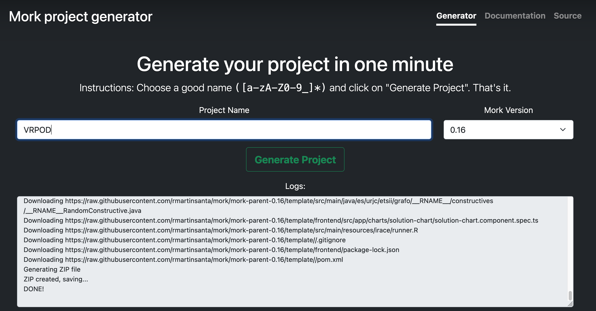
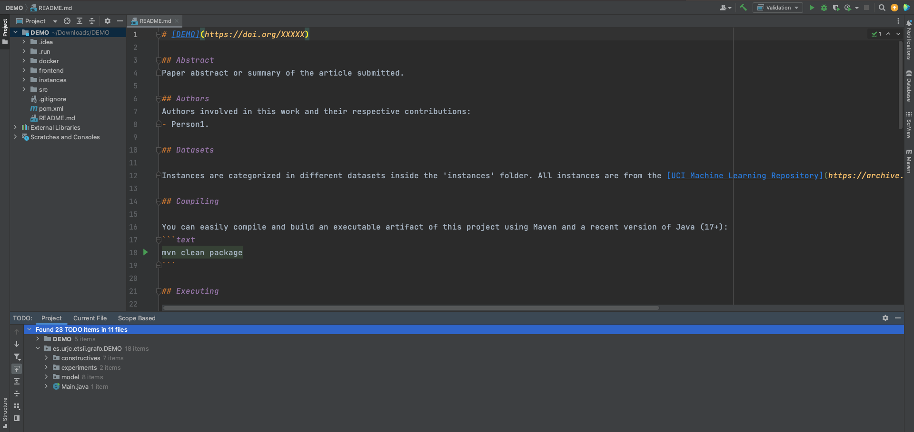
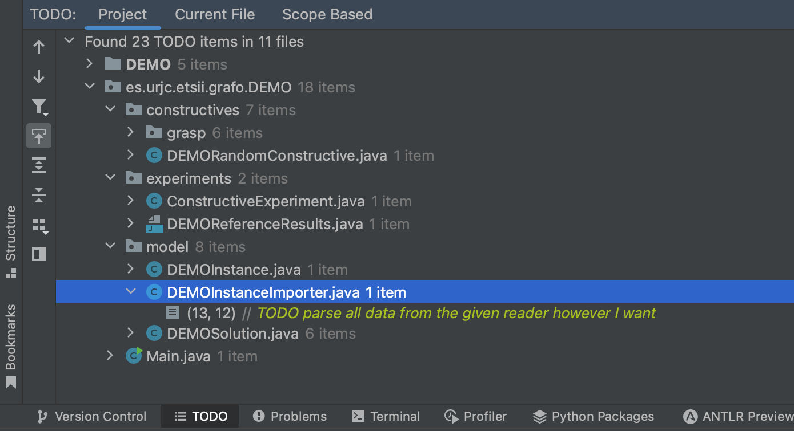
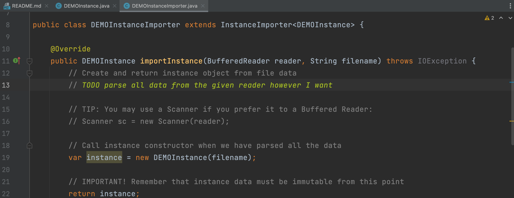

# Getting started

In this page, we will learn how to create an empty Mork project

## Requirements
Before creating a project, you will need to have installed a recent Java SDK and an IDE.
We recommend using the latest LTS Java version (Java 17, as of 2022), and IntelliJ as IDE, 
either the community or professional edition.

!!! tip
    Checkout [SdkMan](tips.md#managing-java-installations) for an easy way to install and manage multiple Java SDKs.

## Creating a project
In order to facilitate project creation, we have created a small tool which automatically initializes an empty project.
Creating a project this way is extremely easy, visit [the tool page](https://rmartinsanta.github.io/mork/), choose a project name, 
optionally select the Mork version you want to use (defaults to the latest stable version) and click on Generate Project
The tool will generate a ZIP file, that can be extracted anywhere and imported in your favourite IDE.

## Start developing

After opening the project in IntelliJ, you will see something similar to the following
.

!!! note inline end

    Although we recommend using IntelliJ, the project is based Maven, which means it will work on any IDE, 
    or even without one for the vim fanatics.

The easiest way to start the project is by copying the instance data and following the TODO list on the IntelliJ tab. 
The TODO list starting with `es.urjc...` provides a list with the minimum required functionality that must be implemented in order to have
a minimal working application. 

Double-clicking any item will take you to the relevant part code. After filling in the blanks, 
remember to delete the no longer relevant comments.

Don't know how to continue? Need inspiration? Take a look at the Examples section,
where you will find detailed explanations and step-by-step guides for different optimization problems. 
For example [The Travelling Salesman Problem](../examples/TSP.md).